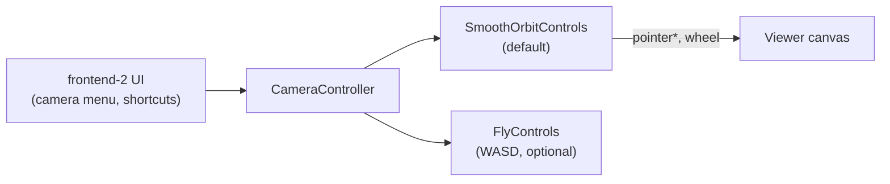

# ORBIT viewer camera controls — mouse, trackpad, and touch

This document describes how the ORBIT web viewer handles **orbit (rotate)**, **pan (move)**, and **zoom** for mouse and trackpad input. It is written so you can reproduce the same feel in another viewer.

The behaviour comes from Speckle’s **`SmoothOrbitControls`** (not Three.js `OrbitControls`), wired through the viewer’s **`CameraController`** extension. ORBIT ships this inside the prebuilt `orbit-frontend` image; the logic lives in upstream `@speckle/viewer` (`packages/viewer/src/modules/extensions/controls/SmoothOrbitControls.ts`).

---

## Summary table

| Action | Mouse | Trackpad | Touch screen |
|---|---|---|---|
| **Orbit (rotate)** | Left-click drag | One-finger click-and-drag | One-finger drag |
| **Pan (move view)** | Right-click drag, **or** drag with **Ctrl / Cmd / Shift** held | Same as mouse (no separate trackpad branch) | Two-finger drag (when pan enabled) |
| **Zoom** | Scroll wheel | Two-finger scroll (emits `wheel` events) | Two-finger pinch |

There is **no dedicated trackpad code path**. Trackpads and mice share the same handlers; differences come from how the OS/browser emits events (continuous small `deltaY` vs discrete wheel ticks).

---

## Architecture



- **Default mode:** `SmoothOrbitControls` — spherical orbit camera with damped interpolation.
- **Alternate mode:** `FlyControls` — first-person WASD + mouse look. Toggled via `CameraController.toggleControls()`; not exposed in the standard UI.
- **Coordinate system:** Z-up for AEC (`up = (0, 0, 1)`). Camera uses spherical coordinates `(theta, phi, radius)` around a movable target.
- **Smoothing:** Every frame, current camera state eases toward a “goal” state using exponential dampers (`damperDecay: 30` ms).

---

## Default configuration

These are the defaults from `DefaultOrbitControlsOptions` in `CameraController.ts`:

| Option | Default | Meaning |
|---|---|---|
| `enableOrbit` | `true` | Allow rotation |
| `enableZoom` | `true` | Allow zoom |
| `enablePan` | `true` | Allow pan |
| `orbitSensitivity` | `1` | Multiplier on orbit drag |
| `zoomSensitivity` | `1` | Multiplier on zoom |
| `panSensitivity` | `1` | Multiplier on pan |
| `inputSensitivity` | `1` | Global multiplier on all input |
| `minimumRadius` | `0` | Closest orbit distance (recomputed from model size at runtime) |
| `maximumRadius` | `Infinity` | Farthest orbit distance (recomputed from model size at runtime) |
| `minimumPolarAngle` | `0` | Minimum elevation above model up |
| `maximumPolarAngle` | `π` | Maximum elevation (full vertical orbit) |
| `minimumAzimuthalAngle` | `-∞` | Horizontal orbit lower bound |
| `maximumAzimuthalAngle` | `∞` | Horizontal orbit upper bound |
| `minimumFieldOfView` | `40` | Min FOV (degrees) |
| `maximumFieldOfView` | `60` | Max FOV (degrees) |
| `touchAction` | `'none'` | Touch scroll disambiguation (touchscreen only) |
| `infiniteZoom` | `true` | Allow zoom past minimum radius by dollying camera forward |
| `zoomToCursor` | `true` | Shift orbit target toward cursor while zooming |
| `orbitAroundCursor` | `true` | Raycast under cursor on pointer down to set orbit pivot |
| `showOrbitPoint` | `true` | Show blue pivot marker while orbiting around cursor hit |
| `damperDecay` | `30` | Smoothing decay time (ms) |

**Camera defaults on load:**

| Property | Value |
|---|---|
| FOV | `55°` |
| Up vector | `(0, 0, 1)` — Z-up |
| Initial azimuth (`theta`) | `2.356 rad` (~135°) upstream; **ORBIT patch → `5.498 rad`** (~−45°, front-facing) |
| Initial polar (`phi`) | `0.955 rad` (~55° elevation) |

**Runtime radius limits** (recomputed from bounding box):

```text
minimumRadius = world.getRelativeOffset(0.01)
maximumRadius = world.getRelativeOffset(10)
```

These scale with model size so navigation feels consistent across tiny and large models.

---

## Mouse input

### Orbit (left drag)

On pointer move (when not in pan mode):

```text
deltaTheta = (2π × dx) / containerHeight
deltaPhi   = (2π × dy) / containerHeight

effectiveDeltaTheta = deltaTheta × orbitSensitivity × inputSensitivity × enableOrbit
effectiveDeltaPhi   = deltaPhi   × orbitSensitivity × inputSensitivity × enableOrbit
```

- Horizontal drag rotates around the vertical (azimuth / `theta`).
- Vertical drag changes elevation (polar / `phi`), clamped by `minimumPolarAngle` / `maximumPolarAngle`.
- **Middle mouse button** follows the same orbit path as left button (pan modifiers are not checked for button 1).

### Pan (right drag or modified drag)

Pan mode starts on pointer down when **any** of these is true:

```text
event.button === 2          // right mouse button
event.ctrlKey
event.metaKey               // Cmd on macOS
event.shiftKey
```

Pan speed is initialized once per gesture:

```text
panPerPixel = (PAN_SENSITIVITY × panSensitivity × enablePan) / containerHeight
             PAN_SENSITIVITY = 0.018
```

On each move:

```text
metersPerPixel = max(relativeFactor, radiusFactor) × exp(logFov) × panPerPixel × inputSensitivity
```

Where:

- `relativeFactor` = `world.getRelativeOffset(0.4)` normally, or `world.getRelativeOffset(0.06)` when the camera is very close to geometry.
- `radiusFactor` = clamp(`spherical.radius`, `world.getRelativeOffset(0.025)`, ∞).

Movement is projected onto the view plane using a 3×3 `panProjection` matrix derived from current `theta` and `phi`, then added to the orbit target.

**Context menu:** Right-click context menu is suppressed when pan is enabled.

### Zoom (scroll wheel)

```text
deltaZoom = (event.deltaY × lineModeMultiplier × ZOOM_SENSITIVITY × zoomSensitivity × enableZoom) / 60

lineModeMultiplier = (event.deltaMode === 1) ? 18 : 1    // DOM_DELTA_LINE
ZOOM_SENSITIVITY   = 0.08
```

Then `deltaZoom` is multiplied again by `inputSensitivity` inside `userAdjustOrbit`.

**Zoom amount in world space** is not a fixed step — it scales with model size and current distance:

```text
normalizedRadius = spherical.radius / worldBoxSize.length()

worldSizeOffset = lerp(
  world.getRelativeOffset(0.16) × |deltaZoom|,
  world.getRelativeOffset(0.64) × |deltaZoom|,
  normalizedRadius >= 0.5 ? exp(normalizedRadius) : normalizedRadius
)

worldSizeOffset = clamp(
  worldSizeOffset,
  world.getRelativeOffset(0.01),
  world.getRelativeOffset(0.2)
)

zoomAmount = worldSizeOffset × sign(deltaZoom)
goalRadius = currentRadius + zoomAmount
```

**Zoom-to-cursor (`zoomToCursor: true`):** While zooming, the orbit target lerps toward the point under the cursor. Normalized cursor coordinates are computed from the wheel event position:

```text
x = ((clientX - rect.left) / rect.width)  × 2 - 1
y = ((clientY - rect.top)  / rect.height) × -2 + 1
```

Only **`deltaY`** is used for zoom; horizontal wheel / trackpad pan (`deltaX`) is ignored.

---

## Trackpad input

Trackpads use the **same code paths** as a mouse. There is no `pointerType === 'trackpad'` branch.

### Typical macOS / Windows mappings

| Trackpad gesture | Browser event | Viewer behaviour |
|---|---|---|
| One-finger click + drag | `pointerdown` / `pointermove` with `pointerType: 'mouse'` | Orbit (same as left mouse drag) |
| Two-finger vertical scroll | `wheel` with small continuous `deltaY` | Zoom (same formula as mouse wheel) |
| Two-finger horizontal scroll | `wheel` with `deltaX` | **Ignored** for navigation |
| Two-finger drag (some drivers) | May appear as `wheel` or modified pointer drag | Depends on OS; often scroll → zoom |

### Why trackpad zoom feels different from a mouse wheel

1. **Continuous deltas:** Trackpads emit many small `deltaY` values per gesture; mouse wheels emit larger discrete steps. Because zoom is **proportional to `deltaY`**, trackpad zoom tends to feel smoother and can feel faster over a full gesture.
2. **Line mode (`deltaMode === 1`):** On Firefox and some configurations, scroll events use line mode and multiply `deltaY` by **18**, which can make trackpad scrolling much more aggressive.
3. **No trackpad-specific dampening:** There is no detection of “small continuous scroll” vs “detented wheel” in the current implementation.

To match ORBIT feel in another viewer, use the same proportional wheel formula rather than fixed “one notch = one zoom step” logic.

---

## Touchscreen input (for completeness)

Not mouse/trackpad, but part of the same control class:

| Fingers | Mode |
|---|---|
| 1 | Rotate (`touchModeRotate`) |
| 2 | Pinch zoom (`touchModeZoom`) + optional pan if `enablePan` |

**Pinch zoom formula:**

```text
deltaZoom = (ZOOM_SENSITIVITY × zoomSensitivity × enableZoom × (lastSeparation - touchDistance) × 50) / containerHeight
```

**`touchAction` option** (`'none'` | `'pan-y'` | `'pan-x'`): On touchscreens only, decides whether a gesture that is mostly vertical/horizontal should yield to browser scrolling instead of orbiting. Does **not** affect laptop trackpads.

---

## Orbit-around-cursor pivot

When `orbitAroundCursor: true` (default), on every pointer down the viewer raycasts under the cursor against visible mesh geometry:

1. If a hit is found → set `pivotPoint` to the hit world position, enable pivotal orbit, optionally show the blue orbit marker.
2. If no hit → orbit around the current target as usual.

This makes rotation feel like it pivots around the object under the cursor rather than always around the scene centre.

---

## Smoothing (damping)

Camera motion is not instantaneous. Each frame, spherical angles, radius, and target position ease toward their goals using dampers with **`damperDecay = 30` ms**.

Implications for another viewer:

- Input sets a **goal** state; the visible camera **interpolates** toward it.
- `jumpToGoal()` snaps immediately (used after programmatic view changes).
- Controls **`update(delta)` must run every animation frame** or smoothing stops working.

---

## User-facing settings (ORBIT frontend)

These are UI-level overrides on top of the defaults above.

### Turntable mode (“Free orbit” toggle)

Stored in cookie `localViewerSettings.turntableMode` (default: `false`).

| Mode | `maximumPolarAngle` | Effect |
|---|---|---|
| Free orbit (default) | `π` (180°) | Full vertical rotation — can go below the horizon |
| Turntable | `π/2` (90°) | Camera stays above the horizon; like a turntable |

### Keyboard shortcuts

| Shortcut | Action |
|---|---|
| **Shift + Space** | Zoom to fit selection, or isolated objects, or entire model |
| **Shift + P** | Toggle perspective / orthographic projection |
| **Alt/Opt + 1** | Top view |
| **Alt/Opt + 2** | Front view |
| **Alt/Opt + 3** | Left view |
| **Alt/Opt + 4** | Back view |
| **Alt/Opt + 5** | Right view |

Zoom-to-fit calls `CameraController.setCameraView(...)` which computes a bounding sphere and animates the camera to frame it.

---

## ORBIT-specific override

ORBIT patches only the **default opening camera angle** — no sensitivity or input-mapping changes.

| | Upstream Speckle | ORBIT |
|---|---|---|
| Default azimuth | `2.356 rad` (~135°, rear 3/4) | `5.498 rad` (~−45°, front 3/4) |
| Default polar | `0.955 rad` | `0.955 rad` (unchanged) |

Patch: `frontend/patches/camera-default.patch`.

---

## Reproducing this in another viewer

### Minimal gesture mapping

```text
Pointer down + move (no pan modifier)  →  orbit
Pointer down + move (right btn or Ctrl/Cmd/Shift)  →  pan
Wheel (deltaY only)  →  zoom toward cursor
```

### Constants to copy

```text
PAN_SENSITIVITY              = 0.018
ZOOM_SENSITIVITY             = 0.08
closeRelativeFactorPan       = 0.06
farRelativeFactorPan         = 0.4
relativeMinTargetDistance    = 0.01   // world-relative zoom step clamp
relativeMaxTargetDistance    = 0.2    // world-relative zoom step clamp
pinchMultiplier (touch)      = 50
wheelLineModeMultiplier      = 18
wheelDivisor                 = 60
damperDecayMs                = 30
defaultFOV                   = 55°
```

### Orbit sensitivity reference

Rotation scales with **viewport height**, not width:

```text
anglePerPixel = 2π / containerHeight
```

This keeps “drag from top to bottom of the viewport ≈ 360° vertical travel” regardless of aspect ratio.

### Pan sensitivity reference

Pan distance per pixel scales with:

- Current orbit radius (clamped minimum),
- Current FOV (`exp(logFov)`),
- Model-relative world scale (`world.getRelativeOffset(...)`).

This is why panning a large building and a small detail object feel similarly “direct” despite different absolute sizes.

### Zoom sensitivity reference

Zoom step size scales with model bounding box and current camera distance, clamped to 1%–20% of world-relative units per tick. Combined with proportional wheel input, this gives:

- Gentle zoom when close / on small models,
- Larger steps when far away,
- Smooth continuous zoom on trackpads.

### Recommended feature flags for parity

| Feature | ORBIT default | Notes |
|---|---|---|
| Orbit around cursor hit | On | Major feel difference vs fixed target |
| Zoom to cursor | On | Target shifts toward pointer while zooming |
| Infinite zoom | On | Allows dollying through minimum radius |
| Z-up | On | Matches AEC convention |
| Damped interpolation | On (`30 ms`) | Without this, controls feel snappy/raw |

---

## Source references

| Item | Location |
|---|---|
| Control implementation | `speckle-server/packages/viewer/src/modules/extensions/controls/SmoothOrbitControls.ts` |
| Defaults & camera setup | `speckle-server/packages/viewer/src/modules/extensions/CameraController.ts` |
| Turntable UI toggle | `speckle-server/packages/frontend-2/components/viewer/camera/Menu.vue` |
| Keyboard shortcuts | `speckle-server/packages/frontend-2/lib/viewer/helpers/shortcuts/shortcuts.ts` |
| ORBIT default azimuth patch | `orbit-server/frontend/patches/camera-default.patch` |

Upstream Speckle viewer docs: [https://docs.speckle.systems/developers/viewer/overview](https://docs.speckle.systems/developers/viewer/overview)

Related ORBIT integrator guide: [Building a 3rd party viewer](building-a-3rd-party-viewer.md)
